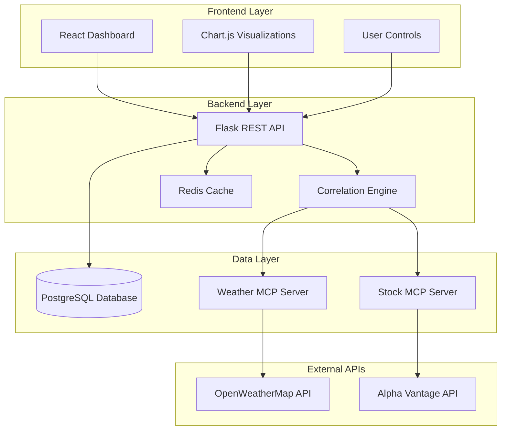

# Data Weaver Dashboard Design Document

## Overview

The Data Weaver Dashboard is a modern web application that discovers and visualizes statistical correlations between disparate data sources. The system employs a three-tier architecture with a React-based frontend, Flask REST API backend, and PostgreSQL database. External data integration is handled through MCP (Model Context Protocol) servers that provide standardized access to weather and financial APIs.

The application focuses on real-time correlation analysis between weather patterns and stock market movements, serving as a proof-of-concept for broader cross-domain data analysis. Users can select different cities, stock symbols, and time ranges to explore relationships and generate actionable insights.

## Architecture

### System Architecture Overview



### Technology Stack

**Frontend:**
- React 18 with TypeScript for component-based UI
- Chart.js for interactive data visualizations
- Tailwind CSS for responsive styling
- Axios for HTTP client communication

**Backend:**
- Flask 2.3 with Python 3.11 for REST API
- SQLAlchemy for database ORM
- Pandas for data manipulation and analysis
- SciPy for statistical calculations
- Redis for caching and session management

**Data & Integration:**
- PostgreSQL 15 for persistent data storage
- MCP Protocol for external API integration
- OpenWeatherMap API for weather data
- Alpha Vantage API for stock market data

**Development & Deployment:**
- Docker for containerization
- pytest for testing framework
- GitHub Actions for CI/CD
- AWS Elastic Beanstalk for deployment

## Components and Interfaces

### Frontend Components

**DashboardContainer**
- Main application container managing global state
- Handles user authentication and session management
- Coordinates communication between child components

**ControlPanel**
- City selector dropdown with major global cities
- Stock symbol input with validation and autocomplete
- Date range picker with preset options (7d, 30d, 90d)
- Refresh button with loading states

**VisualizationPanel**
- Dual-axis line chart showing weather and stock data over time
- Correlation scatter plot with trend line
- Heatmap for multi-dimensional correlation analysis
- Interactive tooltips and zoom functionality

**MetricsPanel**
- KPI cards displaying correlation coefficient
- Statistical significance indicator (p-value)
- Data quality metrics (completeness, freshness)
- Anomaly detection alerts

**InsightsPanel**
- Natural language interpretation of correlations
- Trend analysis and pattern recognition
- Actionable recommendations based on findings
- Export functionality for reports

### Backend Services

**APIController**
- RESTful endpoints for data operations
- Request validation and authentication
- Response formatting and error handling
- Rate limiting and throttling

**CorrelationService**
- Statistical analysis engine using Pandas and SciPy
- Pearson correlation coefficient calculation
- Statistical significance testing (p-value, confidence intervals)
- Anomaly detection using z-score and IQR methods

**DataService**
- MCP client integration for external APIs
- Data validation and cleaning pipelines
- Timestamp alignment and interpolation
- Caching strategy for API responses

**DatabaseService**
- Data persistence and retrieval operations
- Query optimization and indexing
- Migration management
- Backup and recovery procedures

### API Endpoints

```
GET /api/health
- System health check and status

POST /api/data/refresh
- Trigger fresh data fetch from external sources
- Body: { city, symbol, dateRange }

GET /api/correlations/{id}
- Retrieve correlation analysis results
- Query params: format (json|csv)

GET /api/charts/timeseries
- Time series data for visualization
- Query params: city, symbol, startDate, endDate

GET /api/insights/{correlationId}
- Generated insights and recommendations
- Includes natural language explanations
```

## Data Models

### Database Schema

**weather_data**
```sql
CREATE TABLE weather_data (
    id SERIAL PRIMARY KEY,
    timestamp TIMESTAMP WITH TIME ZONE NOT NULL,
    city VARCHAR(100) NOT NULL,
    temperature DECIMAL(5,2) NOT NULL,
    humidity INTEGER NOT NULL,
    precipitation DECIMAL(6,2) DEFAULT 0,
    wind_speed DECIMAL(5,2) NOT NULL,
    condition VARCHAR(50) NOT NULL,
    created_at TIMESTAMP WITH TIME ZONE DEFAULT NOW(),
    INDEX idx_weather_city_timestamp (city, timestamp),
    INDEX idx_weather_timestamp (timestamp)
);
```

**stock_data**
```sql
CREATE TABLE stock_data (
    id SERIAL PRIMARY KEY,
    timestamp TIMESTAMP WITH TIME ZONE NOT NULL,
    symbol VARCHAR(10) NOT NULL,
    open_price DECIMAL(12,4) NOT NULL,
    close_price DECIMAL(12,4) NOT NULL,
    high_price DECIMAL(12,4) NOT NULL,
    low_price DECIMAL(12,4) NOT NULL,
    volume BIGINT NOT NULL,
    created_at TIMESTAMP WITH TIME ZONE DEFAULT NOW(),
    INDEX idx_stock_symbol_timestamp (symbol, timestamp),
    INDEX idx_stock_timestamp (timestamp)
);
```

**correlation_results**
```sql
CREATE TABLE correlation_results (
    id SERIAL PRIMARY KEY,
    calculated_at TIMESTAMP WITH TIME ZONE DEFAULT NOW(),
    city VARCHAR(100) NOT NULL,
    symbol VARCHAR(10) NOT NULL,
    period_days INTEGER NOT NULL,
    correlation_value DECIMAL(8,6) NOT NULL,
    p_value DECIMAL(10,8) NOT NULL,
    sample_size INTEGER NOT NULL,
    weather_variable VARCHAR(50) NOT NULL,
    stock_variable VARCHAR(50) NOT NULL,
    analysis_notes TEXT,
    INDEX idx_correlation_city_symbol (city, symbol),
    INDEX idx_correlation_calculated_at (calculated_at)
);
```

### Data Transfer Objects

**CorrelationRequest**
```typescript
interface CorrelationRequest {
    city: string;
    symbol: string;
    startDate: string;
    endDate: string;
    weatherVariable: 'temperature' | 'humidity' | 'precipitation';
    stockVariable: 'close_price' | 'volume' | 'volatility';
}
```

**CorrelationResult**
```typescript
interface CorrelationResult {
    id: string;
    correlationValue: number;
    pValue: number;
    sampleSize: number;
    significance: 'high' | 'medium' | 'low' | 'none';
    confidence: number;
    insights: string[];
    anomalies: AnomalyPoint[];
}
```

**TimeSeriesPoint**
```typescript
interface TimeSeriesPoint {
    timestamp: string;
    weatherValue: number;
    stockValue: number;
    isAnomaly: boolean;
}
```

## 
## Correctness Properties

*A property is a characteristic or behavior that should hold true across all valid executions of a system-essentially, a formal statement about what the system should do. Properties serve as the bridge between human-readable specifications and machine-verifiable correctness guarantees.*

After analyzing the acceptance criteria, several properties can be consolidated to eliminate redundancy while maintaining comprehensive coverage:

**Property 1: Input validation consistency**
*For any* user input (city, stock symbol, date range), the system should validate it according to defined rules and provide appropriate feedback
**Validates: Requirements 1.2, 1.3, 1.4**

**Property 2: MCP request formatting**
*For any* data request, the system should format MCP calls correctly with all required parameters and handle responses appropriately
**Validates: Requirements 2.1, 2.2, 2.3**

**Property 3: Error handling graceful degradation**
*For any* system error (API failures, invalid data, database issues), the system should handle it gracefully, log appropriately, and provide user-friendly feedback
**Validates: Requirements 2.4, 2.5, 6.1, 6.2, 6.3, 6.4, 6.5**

**Property 4: Data alignment and correlation accuracy**
*For any* pair of time series datasets, timestamp alignment should produce the closest matching records, and correlation calculations should be mathematically correct
**Validates: Requirements 3.1, 3.2, 3.3, 8.1, 8.4**

**Property 5: Anomaly detection consistency**
*For any* dataset with statistical outliers, the anomaly detection algorithm should identify them consistently using defined thresholds
**Validates: Requirements 3.4**

**Property 6: Insight generation completeness**
*For any* correlation result, the system should generate human-readable insights that accurately reflect the statistical findings
**Validates: Requirements 3.5, 4.5**

**Property 7: UI rendering consistency**
*For any* data visualization (charts, KPIs, insights), the interface should render correctly and maintain visual consistency across different data sets
**Validates: Requirements 4.1, 4.2, 4.3, 4.4**

**Property 8: Responsive design adaptation**
*For any* screen size or device type, the interface should adapt appropriately while maintaining functionality
**Validates: Requirements 5.1, 5.3, 5.5**

**Property 9: Data persistence integrity**
*For any* data storage operation (weather, stock, correlation results), the system should maintain data integrity and enforce proper constraints
**Validates: Requirements 7.1, 7.2, 7.3, 7.4**

**Property 10: Query performance and caching**
*For any* data retrieval operation, the system should implement appropriate caching strategies and optimize query performance
**Validates: Requirements 7.5**

**Property 11: Integration workflow completeness**
*For any* end-to-end workflow from data fetch to visualization, all components should integrate correctly and produce expected results
**Validates: Requirements 8.2, 8.5**

## Error Handling

### Error Categories and Strategies

**External API Errors**
- Network timeouts: Implement exponential backoff with jitter
- Rate limiting: Use token bucket algorithm with queue management
- Invalid responses: Validate against JSON schemas and sanitize data
- Authentication failures: Refresh tokens automatically and notify administrators

**Data Processing Errors**
- Insufficient data: Require minimum sample sizes (n≥30 for correlation)
- Missing timestamps: Interpolate using linear or spline methods
- Outlier detection: Use IQR method (Q3 + 1.5*IQR) for anomaly identification
- Correlation edge cases: Handle perfect correlations and zero variance scenarios

**Database Errors**
- Connection failures: Implement connection pooling with health checks
- Query timeouts: Set appropriate timeout limits and optimize slow queries
- Constraint violations: Validate data before insertion and provide meaningful error messages
- Transaction failures: Implement proper rollback mechanisms and retry logic

**User Interface Errors**
- Invalid user input: Client-side validation with server-side verification
- Rendering failures: Graceful degradation with fallback visualizations
- Browser compatibility: Progressive enhancement and polyfills
- Network connectivity: Offline mode with cached data display

### Error Response Format

```typescript
interface ErrorResponse {
    error: {
        code: string;
        message: string;
        details?: any;
        timestamp: string;
        requestId: string;
    };
    suggestions?: string[];
    retryAfter?: number;
}
```

## Testing Strategy

### Dual Testing Approach

The system employs both unit testing and property-based testing to ensure comprehensive coverage:

**Unit Testing Focus:**
- Specific API endpoint behaviors
- Database operation edge cases
- UI component rendering with known data sets
- Error handling for specific failure scenarios
- Integration points between system components

**Property-Based Testing Focus:**
- Statistical calculation accuracy across random datasets
- Data validation with generated valid/invalid inputs
- UI responsiveness across random screen sizes and data volumes
- Error handling consistency across various failure conditions
- End-to-end workflows with randomized user interactions

### Property-Based Testing Framework

**Selected Framework:** Hypothesis (Python) for backend, fast-check (TypeScript) for frontend
**Configuration:** Minimum 100 iterations per property test
**Tagging Convention:** Each property test must include a comment with the format:
`# Feature: data-weaver-dashboard, Property {number}: {property_text}`

### Test Categories

**Statistical Accuracy Tests**
- Correlation coefficient calculations against known datasets
- P-value accuracy for various sample sizes and distributions
- Anomaly detection with synthetic datasets containing known outliers
- Timestamp alignment with irregular time series data

**Data Integration Tests**
- MCP server communication with mock responses
- Database persistence and retrieval operations
- API rate limiting and caching behavior
- Error propagation through the system stack

**User Interface Tests**
- Chart rendering with various data sizes and types
- Responsive design across device viewport ranges
- User interaction flows from selection to visualization
- Error message display and user feedback mechanisms

**Performance Tests**
- Query optimization with large datasets
- Caching effectiveness under load
- Memory usage during correlation calculations
- Response time requirements for user interactions

### Test Data Management

**Synthetic Data Generation:**
- Weather data: Temperature ranges, seasonal patterns, extreme events
- Stock data: Price movements, volume patterns, market volatility
- Time series: Regular intervals, missing data points, timezone handling
- User inputs: Valid/invalid combinations, edge cases, malicious inputs

**Test Environment Setup:**
- Dockerized test databases with known data sets
- Mock MCP servers with configurable responses
- Automated browser testing with Selenium Grid
- CI/CD pipeline integration with GitHub Actions

### Coverage Requirements

**Code Coverage Targets:**
- Backend services: >90% line coverage
- Frontend components: >85% line coverage
- Integration tests: >80% workflow coverage
- Property tests: 100% property implementation

**Quality Gates:**
- All unit tests must pass before deployment
- Property tests must complete without failures
- Performance benchmarks must meet SLA requirements
- Security scans must show no critical vulnerabilities